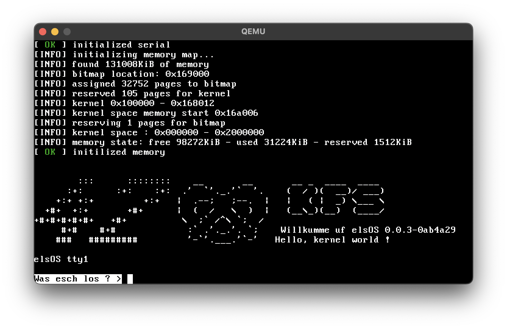
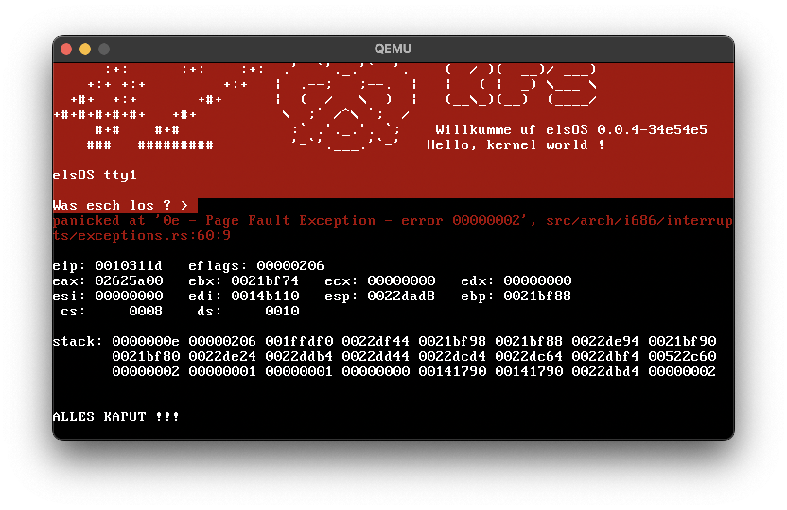

# 🥨 elsOS 🦀

### A funny yet functional italo-alsatian toy-kernel
### The name is a pun mixing Elsàss, Alsace in Alsatian (pronounced like elsOS), and OS



### elsOS, currently a work in progress, is our execution of the 42 Paris project Kernel From Scratch

The whole project is written in Rust 🦀, with some x86 assembly and C as needed, and currently includes the main requirements and bonus tasks for [KFS 1 through 4](docs/42_subjects), as well as additionnal progress for the next KFS projects.

### To date, we have created a 32bit x86 kernel with:
 * multiboot2 compliant boot code
 * a gdt set at 0x800
 * paging, physical and virtual memory management
 * memory allocation through a kmalloc
 * interrupts
   * exceptions
   * IRQs (PIT, keyboard)
   * base for syscalls
 * hidden Alsatian jokes 🥨
 * hidden Italian jokes 🇮🇹

## Build

### Requirements
 * Rust nightly toolchain for `i686-unknown-linux-gnu` target
 * gcc for i686-elf target (can be the i686-elf-gcc package from brew)
 * nasm
 * make
 
### Compile
```sh
make
```

## iso

### Requirements
 * grub-pc for 32bit x86 (not the efi one, not the x86_64 one)  
It can be built from source by using `tools/build_objconv.sh` and `tools/build_grub.sh`
 
### Generate
```sh
make iso
```

## Run

### With qemu-system-i386 (recommanded)
```sh
make run
```

### Any x86 virtual machine

Just boot `build/elsos-i686.iso`

### Any real hardware

This has been quickly tested on real hardware and should work, as long as there is a legacy bios with VGA text mode.


